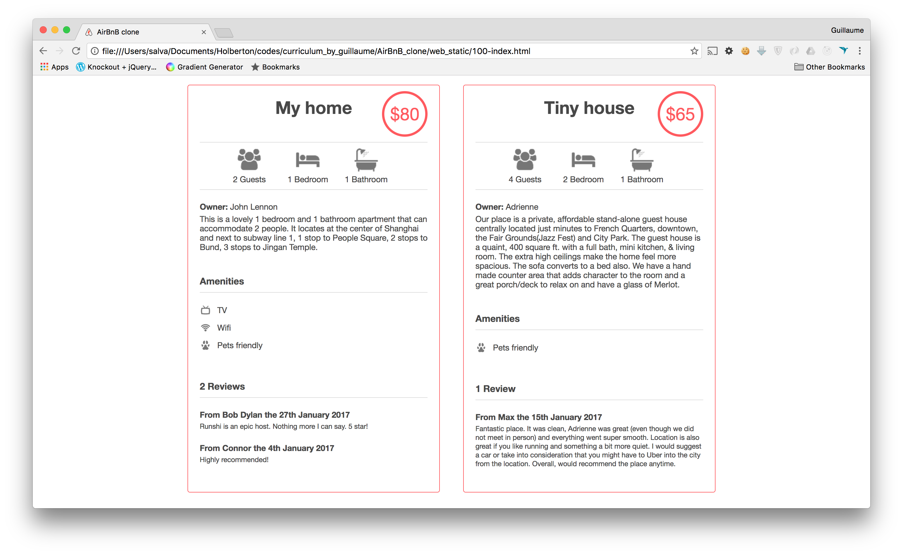

## 9. Full details

# advanced

Write an HTML page that displays a header, footer, a filters box with dropdown and results.

Layout: (based on `8-index.html`)

Add more information to a Place `article`:

- List of Amenities:
	- tag div
	- classname amenities
	-	margin top 40px
	-	contains:
		- title:
			- tag `h2`
			- text `Amenities`
			- font size 16px
			- border bottom #DDDDDD 1px
		- list of amenities:
			- tag ul / li
			- no list style
			- icons on the left: `Pet friendly, TV, Wifi`, etc… feel free to add more
- List of Reviews:
	- tag `div`
	- classname `reviews`
	- margin top 40px
	- contains:
		- title:
			- tag `h2`
			- text `Reviews`
			- font size 16px
			- border bottom #DDDDDD 1px
		- list of review:
			- tag `ul` / `li`
			- no list style
			- a review is described by:
				- `h3` tag for the user/date description (font size 14px). Ex: “From Bob Dylan the 27th January 2017”
				- `p` tag for the text (font size 12px)

## Requirements:

- You must use: `header, footer, section, article, button, h1, h2, h3, h4, ul, li` tags
- No inline style
- You are not allowed to use the `img` tag
- You are not allowed to use the `styl`e tag in the `head` tag
- All images must be stored in the `images` folder
- You must have 5 CSS files:
	- styles/4-common.css: for the global style (`body` and `.container` styles)
	- `styles/3-header.css`: for the header style
	- `styles/3-footer.css`: for the footer style
	- `styles/6-filters.css`: for the filters style
	- `styles/100-places.css`: for the places style

### Repo:

GitHub repository: `holbertonschool-AirBnB_clone`
Directory: web_static
File: 100-index.html, styles/4-common.css, styles/3-header.css, styles/3-footer.css, styles/6-filters.css, styles/100-places.css, images/
